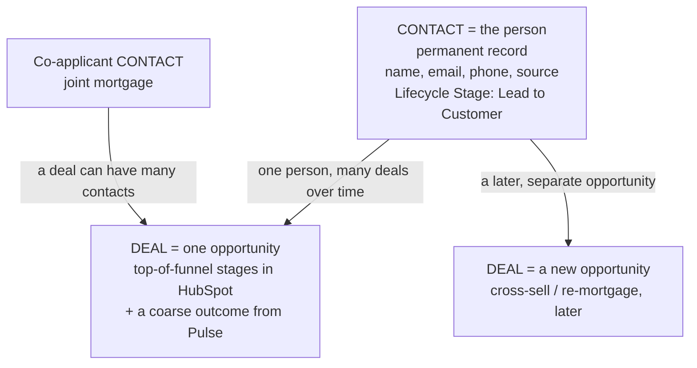
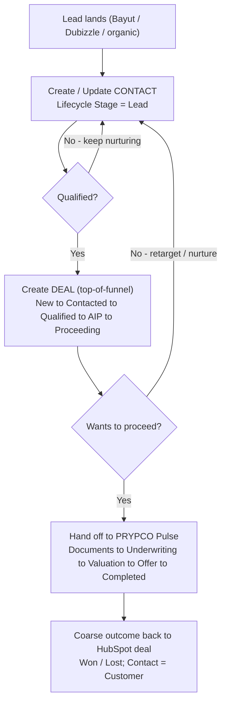
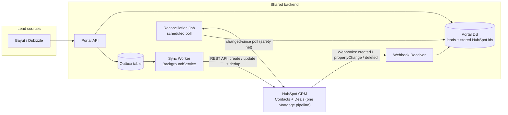
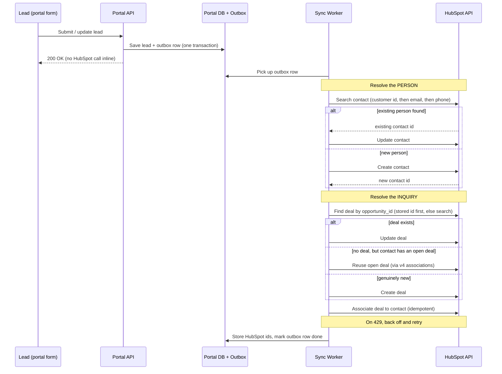
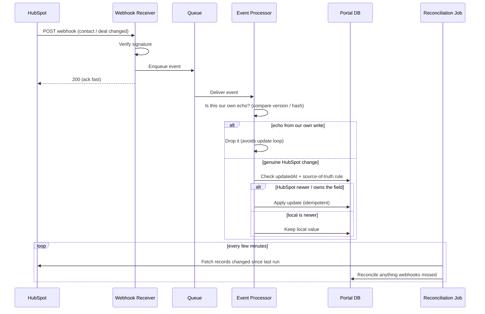
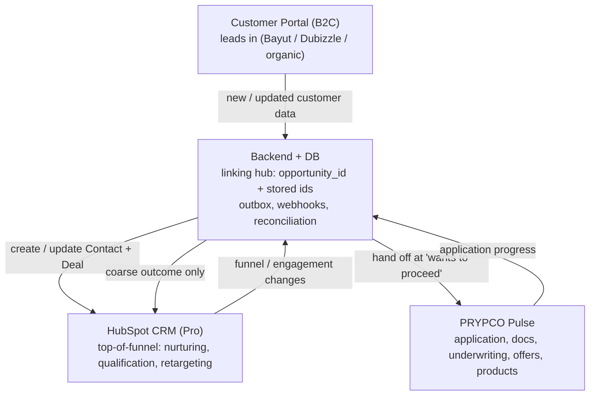
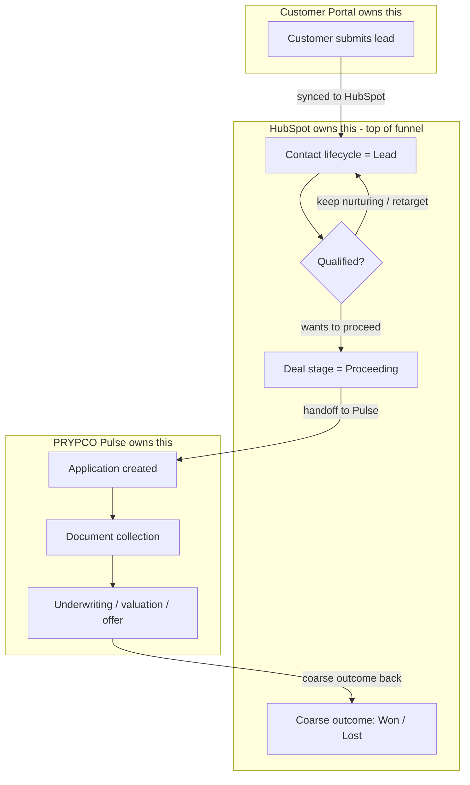

# HubSpot Integration — Concepts & Architecture

Mermaid diagrams for (1) how HubSpot models the lead → deal → application flow, and
(2) how to architect the two-way sync between the customer portal and HubSpot.

---

## 1. The HubSpot object model (the mental model)

Unlike Salesforce, nothing "converts". The **Contact is the person and lives
forever**; a **Deal** is one opportunity attached to it. In HubSpot the deal covers the
**top-of-funnel** stages; the application itself runs in **PRYPCO Pulse** (only a coarse
outcome comes back to the deal). One person can have many deals over time, and one deal
can have many contacts (joint applicants).

---

## 2. The lead journey (what gets created, and when)

The **Lifecycle Stage** is a label on the Contact that advances over time. A **Deal** is
created when there's a real opportunity. HubSpot covers the **top-of-funnel** stages; once
the user wants to proceed, the application runs in **PRYPCO Pulse**, and only a coarse
outcome flows back to the HubSpot deal.

---

## 3. System architecture (overview)

Leads flow in from the portal; the backend owns a local copy and pushes to HubSpot
asynchronously. HubSpot pushes changes back via webhooks, with a scheduled
reconciliation job as a safety net for anything webhooks miss.

---

## 4. Outbound sync — portal to HubSpot (with de-duplication)

The web request never calls HubSpot directly: it writes the lead and an outbox row
in one transaction and returns. A worker drains the outbox, resolves the **person**
and then the **inquiry**, links them, and stores the returned ids.

---

## 5. Inbound + two-way sync — HubSpot back to the portal

Webhooks are HubSpot's version of Salesforce CDC. Validate the signature,
acknowledge fast, then process asynchronously — guarding against echo loops and
field conflicts. A reconciliation poll catches changes webhooks don't emit.

---

## 6. Three systems, not one — and who owns what

HubSpot handles top-of-funnel nurturing; once a user wants to proceed, processing happens
in **PRYPCO Pulse**. The backend DB is the hub linking the customer portal, HubSpot, and
Pulse. Each owns one slice of the data; every field flows one way from its owner.

Ownership rule of thumb:
- **Customer portal** masters customer-submitted identity + inquiry data.
- **HubSpot** masters top-of-funnel: lifecycle stage, lead status, top-of-funnel deal stage, owner.
- **PRYPCO Pulse** masters the application, documents, offers, and products. HubSpot gets a coarse outcome only.

---

## 7. Top-of-funnel to handoff to Pulse (who owns each stage)

The lead flows from the customer, to HubSpot for top-of-funnel nurturing/qualification, to
**PRYPCO Pulse** for the application — with only a coarse outcome flowing back to HubSpot.

---

### Notes

- Diagrams 1–2 are the **concepts**, 3–5 the **build**, 6–7 the **multi-system picture**.
- The outbound flow (4) is what our PoC app exercises, incl. open-deal reuse via associations.
- The inbound flow (5) is built (lighter — funnel/engagement, not application detail): the
  webhook processor + reconciliation sweep update the local mirror for HubSpot-owned fields.
- Per the 2026-06-04 call: HubSpot is **top-of-funnel only**; **PRYPCO Pulse** is the
  processing system of record. No Offer/Product objects in HubSpot; the offer is a
  human-readable attribute. The HubSpot deal pipeline is top-of-funnel + a coarse outcome.
